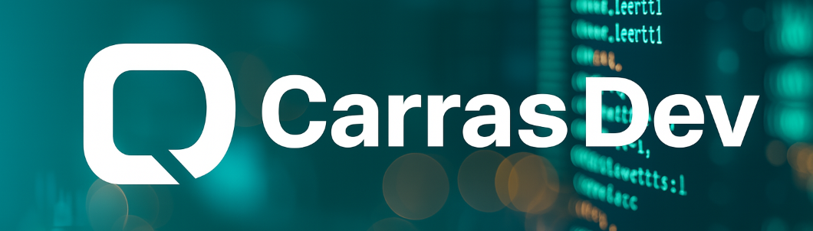

<h1 aling="center">Hola, soy Daniel Carrasco 👋<h1>

## 👨‍💻 Sobre mi

Profesional con 16 años de experiencia en logística industrial, especializado en mejora continua y análisis de procesos. He crecido desde roles operativos al liderazgo de operaciones clave en expediciones, almacenes y suministro a planta, donde la precisión y eficiencia son esenciales.

En 2023 decidí reorientar mi carrera hacia el desarrollo de software, impulsado por una vocación tecnológica consolidada. Actualmente curso el CFGS en Desarrollo de Aplicaciones Multiplataforma (DAM), y estoy construyendo proyectos educativos en Python, Java y C, aplicando buenas prácticas de desarrollo, control de versiones con Git, y documentación clara.

Mi propósito es unir el conocimiento profundo de los procesos industriales con el poder del software. La logística me entrenó para entender cómo fluyen los procesos en una empresa; ahora quiero aplicar esa visión práctica en el diseño de soluciones tecnológicas que resuelvan necesidades reales.

## 🎯 Objetivo actual

Busco mi primera oportunidad profesional en el sector IT, donde pueda seguir aprendiendo, aportar soluciones fiables y crecer como desarrollador. Me interesan especialmente los proyectos que mejoran la productividad, automatizan procesos o permiten colaborar en entornos técnicos con impacto real.

## 🛠️ Tecnologías y Metodologías

- Python · Java · C · SQL
- MySQL · JPA · Hibernate
- XML · HTML
- JavaFX · PyGame
- Git · GitHub
- Diagramas UML
- Patrones de diseño

## 📚 Proyectos destacados

**⚠️ Sección en desarrollo...** Pendiente de poner al día algunos repositorios Privados 

- 🎮 [Tetris en Python](https://github.com/CarrasDev/Tetris_Game)  
  El clásico Tetris implementado en Python haciendo uso de POO y la librería Pygame.
- 📊 [Gestor de tienda Online](https://github.com/CarrasDev/Online_Store)
  Aplicación de escritorio en Java para la gestión de productos, clientes y pedidos de una tienda online. Utiliza JavaFX para la interfaz gráfica y MySQL para el almacenamiento de datos.
- 📡 [DNS OptimizerXML](https://github.com/CarrasDev/DNS_OptimizerXML)
  Herramienta de terminal realizada en C para optimizar la configuración de DNS en entornos empresariales. Permite analizar el rendimiento de las DNS de un equipo, cambiar DNS si es necesario y generar un archivo XML con la configuración establecida.

## 🚀 En que estoy trabajando actualmente

- Integración de musica de fondo y efectos de sonido en el Tetris. (No prioritario)
- Formándome en IA aplicada al desarrollo.
- Formándome en FastAPI y desarrollo backend con Python. (En pausa por los proyectos educativos JE-UOC)
- Proyecto educativo en JE-UOC para la gestión de reservas en un Gimnasio (GenteFIT) usando tecnología .NET.
- Proyecto educativo en JE-UOC para la integración de IoT en una SmartCity. 
- Próximo proyecto personal: Aplicación de escritorio para la gestión de notas con análisis de texto y etiquetas haciendo uso de FastAPI para integrar IA en el backend.

## 🤝 Cómo colaborar

Estoy abierto a feedback, propuestas de colaboración y revisión de código. Si te interesa podemos conectar.

💼 [LinkedIn](https://www.linkedin.com/in/danielcarrascoluque/) 
📧 carrasdev@gmail.com

---

**¡Gracias por visitar mi perfil! 
¡Seguimos aprendiendo!** 🚀