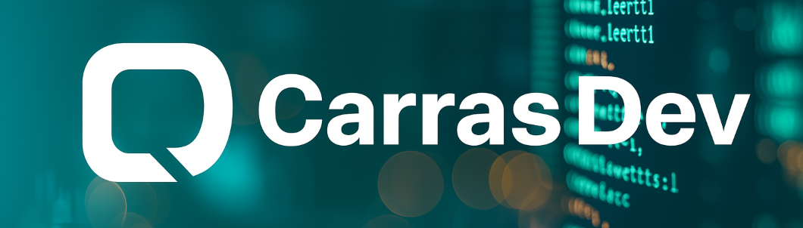

<h1 align="center">Hola, soy Daniel Carrasco 👋</h1>

## 👨‍💻 Sobre mí

**Desarrollador de Software en pleno crecimiento, enfocado en el ecosistema Backend (.NET / C#)** e integración de sistemas. Mi perfil combina una mentalidad analítica y estructurada con una madurez profesional diferencial: tras **15 años optimizando procesos logísticos globales** bajo metodologías Lean en el sector automotriz, decidí pivotar mi carrera hacia el desarrollo tecnológico. 

Esta hibridación me aporta una gran comprensión de las arquitecturas de negocio, dominio de flujos de datos complejos y la capacidad de entender rápidamente las necesidades reales de una empresa.

Durante mi última etapa, completé mis prácticas como **Software Developer Intern en Nexellis**. Fue un reto que puso a prueba mi capacidad de autoaprendizaje autónomo: logré aprender por mi cuenta un lenguaje de nicho desde cero y llevar a cabo la **migración arquitectónica completa de un módulo de gestión de incidencias** desde sistemas heredados (C/SIDE) hacia extensiones nativas en lenguaje AL para entornos Cloud de Microsoft Dynamics 365. Sé que me queda mucho camino técnico por recorrer, pero demuestro que puedo absorber cualquier tecnología que se me ponga por delante.

## 🎯 Objetivo actual

Busco incorporarme a una **compañía con una cultura de ingeniería madura, que cuente con un buen equipo técnico y un plan de formación estructurado**. 

Mi meta es encontrar un entorno donde pueda aportar mi bagaje en optimización de operaciones y flujos lógicos, mientras sigo creciendo y absorbiendo buenas prácticas de desarrollo (Clean Code, metodologías ágiles, testing) de la mano de mentores y profesionales Senior.

## 🛠️ Tecnologías y Metodologías

- **Lenguajes & Frameworks:** C# · .NET · SQL (PL/SQL) · Java · Python · C · AL · C/SIDE
- **Bases de Datos & ORMs:** SQL Server · MySQL · JPA · Hibernate
- **Entornos & Herramientas:** Git · GitHub · Docker · Azure (En preparación) · Linux
- **Metodologías & Diseño:** Metodologías Lean · Scrum / Ágil · Diagramas UML · Patrones de diseño · Clean Architecture

## 📚 Proyectos destacados

**⚠️ Sección en desarrollo...** Actualizando y abriendo repositorios privados... 

- 🎮 [Tetris en Python](https://github.com/CarrasDev/Tetris_Game) 
  El clásico Tetris implementado en Python haciendo uso de POO y la librería Pygame.
- 📊 [Gestor de tienda Online](https://github.com/CarrasDev/Online_Store) 
  Aplicación de escritorio en Java para la gestión de productos, clientes y pedidos de una tienda online. Utiliza JavaFX para la interfaz gráfica y MySQL para el almacenamiento de datos.
- 📡 [DotNetProject - GenteFit](https://github.com/CarrasDev/DotNetProject) 
  Aplicación de escritorio en C# y .NET para la gestión de reservas de salas de entrenamiento en un gimnasio. Implementa un sistema de autenticación, gestión de usuarios y reservas, y utiliza SQL Server para la persistencia de datos. Cuenta con un módulo de integración con Odoo (ERP), desarrollado en Python, para la transferencia de datos entre ambos sistemas.

## 🚀 En qué estoy trabajando actualmente

- Actualmente estoy profundizando en **.NET Core y C#**, explorando la creación de **APIs RESTful** y la integración con bases de datos SQL Server. Estoy desarrollando un proyecto personal que consiste en una **API para la gestión de un almacén**, donde aplico principios de Clean Code, pruebas unitarias y patrones de diseño para mejorar la mantenibilidad y escalabilidad del código. Mi objetivo es dominar la arquitectura de software y las mejores prácticas en el desarrollo backend, con miras a contribuir de manera efectiva en proyectos empresariales.
- Preparándome para obtener la **certificación de Microsoft Certified: Azure Fundamentals AZ-900**, con el objetivo de fortalecer mis conocimientos en servicios en la nube y su integración con aplicaciones .NET.

## 🤝 Cómo colaborar

Estoy abierto a feedback, propuestas de colaboración y revisión de código. Si te interesa podemos conectar.

💼 [LinkedIn](https://www.linkedin.com/in/danielcarrascoluque/) 
📡 [Website personal](https://www.carrasdev.com/) 

---

**¡Gracias por visitar mi perfil! 
¡Seguimos aprendiendo!** 🚀